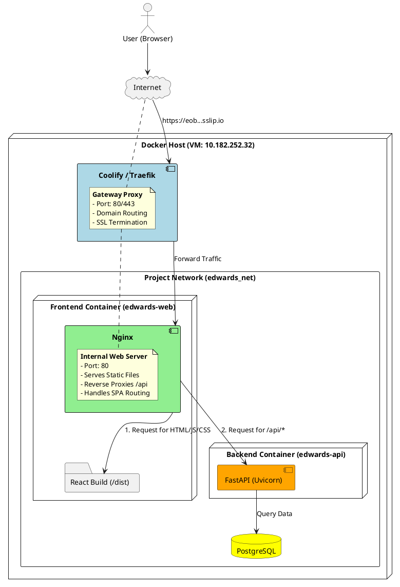

# Deployment & Routing Architecture

This document describes the routing architecture for the Edwards Engineering Resource Management system, specifically focusing on the "Dual Proxy" pattern used in the production environment (Coolify/Docker).

## High-Level Overview

The application utilizes a two-tier proxy architecture to ensure separation of concerns, security, and efficient static asset delivery.

1.  **Outer Layer (Gateway):** **Traefik** (managed by Coolify) handles ingress traffic, domain resolution, and SSL termination.
2.  **Inner Layer (Application):** **Nginx** (inside the Frontend container) serves static React files and routes API requests to the Backend container.

## Architecture Diagram (PlantUML)

## Detailed Flow

### 1. Ingress (Traefik)
*   The user requests `http://eob.10.182.252.32.sslip.io`.
*   Traefik receives this request on the host machine.
*   Based on the hostname, Traefik routes the traffic to the **Frontend Container (`edwards-web`)** on port 80.

### 2. Frontend Serving (Internal Nginx)
Inside the `edwards-web` container, Nginx is listening. It handles two types of traffic:

*   **Static Content (UI):**
    *   If the request is for `/`, `/index.html`, `/assets/...`, Nginx serves the pre-built React files directly from the disk.
    *   This is highly optimized for speed and prevents the Backend from wasting resources on file serving.
    *   **SPA Handling:** Nginx is configured (`try_files`) to redirect unknown paths to `index.html`, allowing React Router to handle client-side navigation.

*   **API Requests (Backend Proxy):**
    *   If the request starts with `/api`, Nginx acts as a **Reverse Proxy**.
    *   It forwards the request to the **Backend Container (`edwards-api`)** on port 8004.
    *   *Configuration Note:* We use Docker's internal DNS resolver (`127.0.0.11`) to resolve `http://edwards-api` at runtime to prevent startup crashes.

### 3. Backend Processing (FastAPI)
*   The FastAPI application receives the request from Nginx (not directly from Traefik).
*   It processes the logic, queries the database, and returns JSON responses.

## Why this structure?

| Feature | Traefik (Outer) | Nginx (Inner) |
| :--- | :--- | :--- |
| **Role** | Traffic Cop (Routing between different apps) | Specialist (Serving files for *this* app) |
| **Static Files** | Cannot serve files efficiently | Extremely fast at serving static files |
| **Coupling** | Decoupled from app logic | Tightly coupled with the Frontend build |
| **Config** | Managed by Coolify GUI | Managed by `nginx.conf` in repo |

This structure is standard for modern containerized web applications, providing the best balance of performance (Nginx for static files) and flexibility (Traefik for domain management).
