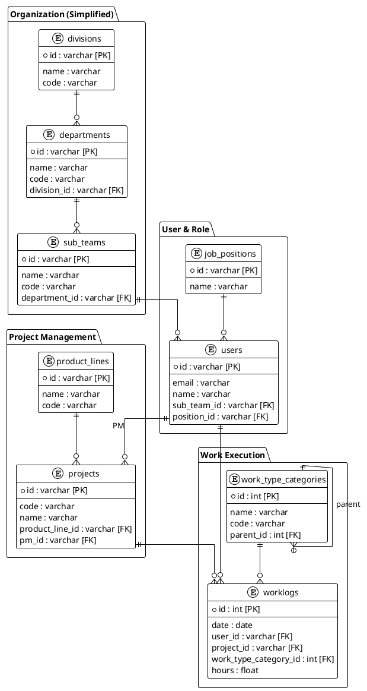

# 데이터 모델 개선 계획서

## 1. 개요

현재 데이터베이스 스키마를 분석한 결과, **중복된 경로(Multiple Paths)**, **불필요한 컬럼**, 그리고 **데이터 불일치 가능성**이 있는 구조가 발견되었습니다.

이 문서는 이러한 문제점을 해결하기 위한 개선 계획을 정의합니다.

> [!IMPORTANT]
> 모든 변경 사항은 **데이터 백업 후** 진행해야 하며, **개발 환경에서 충분히 테스트** 후 운영 환경에 적용해야 합니다.

---

## 2. 현재 문제점 및 개선 항목

### 2.1. 조직 계층 구조의 "다이아몬드 결합"

| 항목 | 내용 |
|------|------|
| **현재 상태** | `departments` 테이블이 `business_units`와 `divisions` 두 곳을 모두 FK로 참조 |
| **문제점** | BU와 Division이 논리적으로 연결되지 않은 경우 데이터 정합성 깨짐 |
| **영향도** | 중간 (조직 관리 혼란) |

**개선안:**
- `departments.business_unit_id` 컬럼을 **Drop**합니다.
- 조직 구조는 `Division > Department > SubTeam` 단일 계층으로 정리합니다.
- BU 정보가 필요한 경우 별도 매핑 테이블로 관리하거나, Division 레벨에서 BU 정보를 연결합니다.

---

### 2.2. 프로젝트-라인업 매핑의 이중 경로

| 항목 | 내용 |
|------|------|
| **현재 상태** | `projects.product_line_id` FK + `project_product_lines` 매핑 테이블 동시 존재 |
| **문제점** | 한쪽만 업데이트되면 데이터 불일치 발생 |
| **영향도** | 높음 (프로젝트 관리 혼란) |

**개선안:**
- 프로젝트는 **1개의 라인업에만 속함** (1:N 관계)으로 유지합니다.
- `project_product_lines` 테이블을 **Drop**합니다.
- `projects.product_line_id` 컬럼만 유지합니다.

---

### 2.3. Worklogs 업무 유형 식별자 통일

| 항목 | 내용 |
|------|------|
| **현재 상태** | `worklogs` 테이블에 `work_type`(string)과 `work_type_category_id`(int) 혼재 |
| **문제점** | 텍스트와 ID 병행 기록으로 통계 오류 발생 가능 |
| **영향도** | 높음 (리포트 정확성) |

**개선안:**
- `worklogs.work_type` 문자열 컬럼을 **Drop**합니다.
- `worklogs.meeting_type` 문자열 컬럼을 **Drop**합니다 (work_type_categories에 이미 상세 분류 존재).
- `work_type_category_id` FK만 사용하도록 강제합니다.

---

### 2.4. 유저 소속 정보의 중복

| 항목 | 내용 |
|------|------|
| **현재 상태** | `users` 테이블에 `department_id`와 `sub_team_id` 동시 존재 |
| **문제점** | SubTeam A에 속했는데 Department가 다른 곳이면 계층 꼬임 |
| **영향도** | 중간 (데이터 정합성) |

**개선안:**
- `users.department_id` 컬럼을 **Drop**합니다.
- 부서 정보는 `sub_teams.department_id`를 통해 조인으로 조회합니다.
- 팀에 속하지 않은 인원은 "General" 가상 팀에 배치합니다.

---

### 2.5. Resource Plans의 Position 중복

| 항목 | 내용 |
|------|------|
| **현재 상태** | `resource_plans`에 `user_id`와 `position_id` 동시 존재 |
| **문제점** | user_id가 지정되면 position은 users 테이블에서 조회 가능 |
| **영향도** | 낮음 (중복 데이터) |

**개선안:**
- **유지**: 미확정 인원(Generic Role) 계획에서 position_id가 필요하므로 현재 구조 유지
- 단, 로직에서 user_id가 있을 경우 position_id는 users 테이블에서 가져오도록 일관성 적용

---

## 3. Drop 대상 컬럼/테이블 요약

| 테이블 | 컬럼/테이블 | 조치 | 사유 |
|--------|-------------|------|------|
| `departments` | `business_unit_id` | DROP COLUMN | Division으로 계층 정리 |
| `project_product_lines` | (전체 테이블) | DROP TABLE | projects.product_line_id로 1:N 관계 유지 |
| `worklogs` | `work_type` | DROP COLUMN | work_type_category_id로 통일 |
| `worklogs` | `meeting_type` | DROP COLUMN | 카테고리에 이미 상세 분류 존재 |
| `users` | `department_id` | DROP COLUMN | sub_team_id를 통해 조인 가능 |

---

## 4. 마이그레이션 SQL 스크립트

> [!WARNING]
> 반드시 **백업 후** 실행하세요. `python3 backup_db.py` 명령으로 백업을 먼저 수행합니다.

### 4.1. 사전 작업: 데이터 백업

```bash
# 로컬 DB 백업
python3 backup_db.py
```

### 4.2. Phase 1: 조직 계층 정리

```sql
-- departments에서 business_unit_id 컬럼 제거
-- 먼저 FK 제약 조건 삭제
ALTER TABLE departments DROP CONSTRAINT IF EXISTS departments_business_unit_id_fkey;

-- 컬럼 삭제
ALTER TABLE departments DROP COLUMN IF EXISTS business_unit_id;
```

### 4.3. Phase 2: 프로젝트-라인업 이중 경로 정리

```sql
-- project_product_lines 매핑 테이블 삭제
DROP TABLE IF EXISTS project_product_lines;
```

### 4.4. Phase 3: Worklogs 컬럼 정리

```sql
-- work_type 문자열 컬럼 삭제 (이미 work_type_category_id로 관리)
ALTER TABLE worklogs DROP COLUMN IF EXISTS work_type;

-- meeting_type 문자열 컬럼 삭제 (카테고리에 상세 분류 존재)
ALTER TABLE worklogs DROP COLUMN IF EXISTS meeting_type;
```

### 4.5. Phase 4: 유저 소속 정보 정리

```sql
-- 먼저 FK 제약 조건 삭제
ALTER TABLE users DROP CONSTRAINT IF EXISTS users_department_id_fkey;

-- department_id 컬럼 삭제
ALTER TABLE users DROP COLUMN IF EXISTS department_id;
```

---

## 5. 코드 수정 영향 범위

### 5.1. Backend (FastAPI)

| 파일 | 수정 내용 |
|------|----------|
| `app/models/*.py` | SQLAlchemy 모델에서 삭제된 컬럼/테이블 제거 |
| `app/schemas/*.py` | Pydantic 스키마에서 삭제된 필드 제거 |
| `app/api/endpoints/*.py` | 관련 API 로직 수정 |
| `app/services/*.py` | 비즈니스 로직에서 삭제된 필드 참조 제거 |

### 5.2. Frontend (React)

| 파일 | 수정 내용 |
|------|----------|
| `src/types/*.ts` | TypeScript 타입 정의에서 삭제된 필드 제거 |
| `src/components/**/*.tsx` | UI 컴포넌트에서 삭제된 필드 참조 제거 |
| `src/hooks/*.ts` | API 호출 로직 수정 |

---

## 6. 검증 계획

### 6.1. 자동 검증

1. **백엔드 서버 시작**: `./run.py backend` 실행 후 에러 없이 구동되는지 확인
2. **API 문서 접속**: `http://localhost:8004/docs` 에서 Swagger UI 정상 로드 확인

### 6.2. 수동 검증

1. **조직 관리 페이지**: `/organization` 접속 → Division > Dept > SubTeam 트리 정상 표시 확인
2. **프로젝트 관리**: 새 프로젝트 생성 시 라인업 선택 정상 동작 확인
3. **Worklog 등록**: 업무 유형 선택 → 카테고리 트리로 정상 동작 확인
4. **사용자 관리**: 사용자 팀 변경 시 부서 정보 자동 반영 확인

---

## 7. 일정 (예상)

| 단계 | 작업 내용 | 예상 소요 |
|------|----------|----------|
| **1단계** | 계획 리뷰 및 승인 | 1일 |
| **2단계** | DB 마이그레이션 실행 | 1시간 |
| **3단계** | 백엔드 모델/API 수정 | 2-3시간 |
| **4단계** | 프론트엔드 수정 | 2-3시간 |
| **5단계** | 통합 테스트 | 1일 |

---

## 8. ERD (개선 후)



---

## 9. 결론

이 개선 작업을 통해:
- **데이터 정합성** 향상 (중복 경로 제거)
- **유지보수성** 향상 (단순화된 스키마)
- **개발 생산성** 향상 (혼란 감소)

> [!NOTE]
> 위 계획에 대한 리뷰 후 승인되면 구현 단계로 진행합니다.