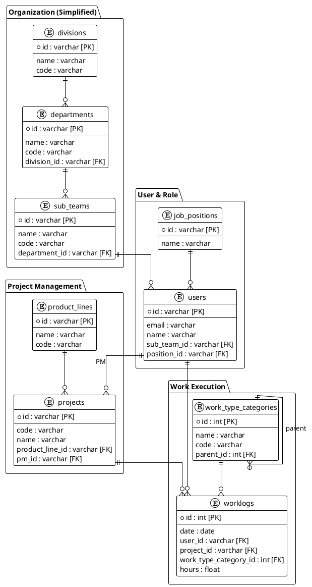

# 데이터 모델 & DB 스키마 (최신)

이 문서는 현재 코드베이스(특히 `backend/app/models/*`)를 기준으로 한 **권장/기준 데이터 모델**을 정리합니다.

> [!IMPORTANT]
> 현재 애플리케이션은 시작 시 `Base.metadata.create_all()`로 테이블을 생성/보정합니다.
> `.env`의 `RESET_DB=true`를 켜면 public schema를 drop & recreate 합니다.
> Alembic `backend/alembic/versions/*`는 존재하지만, 현 시점에서는 "정확한 최신 스키마의 단일 근거"로 사용되지 않습니다.

## 1. 큰 그림

- 조직: `divisions` → `departments` → `sub_teams`
- 사용자: `users`는 `sub_teams`(옵션) + `job_positions`(필수)에 속함
- 프로젝트: `programs`/`project_types` 기반의 `projects` + `project_milestones`
- 실적: `worklogs`는 날짜/시간 + (프로젝트 또는 제품군) + `work_type_categories`(업무유형 트리)
- 계획: `resource_plans`(월 단위) 및 시나리오(`project_scenarios`, `scenario_*`)

## 2. 핵심 테이블 요약

### 2.1 조직

#### divisions (L0)
- `id` (PK), `code` (unique), `name`, `is_active`, timestamps

#### departments (L1)
- `id` (PK), `division_id` (FK, nullable), `code` (unique), `name`, `is_active`, timestamps
- Functional 프로젝트 소유 조직을 위해 `projects.owner_department_id`가 `departments.id`를 참조할 수 있음

#### sub_teams (L2)
- `id` (PK), `department_id` (FK), `code` (unique), `name`, `is_active`, timestamps

### 2.2 사용자/역할

#### job_positions (FunctionalRole)
- `id` (PK), `name`, `level`, `std_hourly_rate`, `is_active`, timestamps

#### users
- `id` (PK, UUID), `email`(unique), `hashed_password`
- `name`, `korean_name`
- `sub_team_id` (FK, nullable), `position_id` (FK)
- `role` (예: `ADMIN`, `PM`, `FM`, `USER`), `is_active`, timestamps

#### user_history
- 사용자 조직/직무 변화를 기간으로 기록
- `user_id` (FK), `department_id` (FK), `sub_team_id` (FK, nullable), `position_id` (FK)
- `start_date`, `end_date`(nullable), `change_type`, `remarks`

### 2.3 프로젝트/제품군

#### business_units
- `id` (PK), `code` (unique), `name`, `is_active`, timestamps

#### programs
- `id` (PK), `business_unit_id` (FK), `name`, `is_active`, timestamps

#### project_types
- `id` (PK), `name`, `description`, `is_active`

#### product_lines
- `id` (PK), `code` (unique), `name`
- `business_unit_id` (FK, nullable)
- `line_category` (예: `PRODUCT`, `PLATFORM`, `LEGACY`), `is_active`, timestamps

#### projects
- `id` (PK, UUID), `program_id` (FK), `project_type_id` (FK)
- `code` (unique), `name`
- `status` (예: `Prospective`, `Planned`, `InProgress`, `OnHold`, `Cancelled`, `Completed`)
- `category` (예: `PRODUCT`, `FUNCTIONAL`)
- `scale` (예: `CIP`, `A&D`, `Simple`, `Complex`, `Platform`)
- `product_line_id` (FK, nullable) + `project_product_lines`(다대다, cross-family 지원)
- `owner_department_id` (FK, nullable) : Functional 프로젝트의 소유 조직
- `pm_id` (FK, nullable)
- `start_month`, `end_month` (YYYY-MM)
- `customer`, `product`, `description`, timestamps

#### project_product_lines (many-to-many)
- `project_id` (FK), `product_line_id` (FK)

#### project_milestones
- `project_id` (FK)
- `name`, `type` (`STD_GATE`, `CUSTOM`), `target_date`, `actual_date`
- `status` (`Pending`, `Completed`, `Delayed`), `is_key_gate`, timestamps

### 2.4 업무 유형 (계층)

#### work_type_categories
- `id` (PK), `code`(unique), `name`, `name_ko`, `description`
- `level` (1/2/3), `parent_id` (self FK)
- `sort_order`, `is_active`
- `applicable_roles` (nullable): 사용 가능한 역할 제한(문자열)
- `project_required` (bool): 프로젝트/제품군 선택 필수 여부

#### work_type_legacy_mappings
- 레거시 문자열(work type)을 카테고리로 매핑
- `legacy_work_type` (unique), `category_id` (FK)

### 2.5 실적/계획

#### worklogs
- `id` (PK), `date` (date)
- `user_id` (FK)
- `project_id` (FK, nullable): 비프로젝트 업무 가능
- `product_line_id` (FK, nullable): 프로젝트 없이 제품군 지원 업무 가능
- `work_type_category_id` (FK)
- `hours`, `description`
- `is_sudden_work`, `is_business_trip`, timestamps

#### project_roles
- 프로젝트 수행 역할 마스터
- `id` (PK), `name`, `category`, `std_hourly_rate`, `is_active`, timestamps

#### resource_plans
- 월 단위 계획
- `project_id` (FK), `year`, `month`
- `position_id` (FK), `project_role_id` (FK, nullable)
- `user_id` (FK, nullable) : 미지정(TBD) 가능
- `planned_hours`, `created_by` (FK), timestamps

#### project_scenarios / scenario_milestones / scenario_resource_plans
- 프로젝트별 일정/리소스 계획 시나리오를 별도로 관리

### 2.6 공통 데이터

#### common_codes
- 공통 코드(그룹 + 코드)
- `group_code`, `code_id`, `name`, `description`, `sort_order`, `is_active`, timestamps

#### holidays
- `date`, `name`, `type` (`LEGAL`, `COMPANY`), `year`

## 3. 실무 팁

- 최신 엔드포인트/스키마 확인은 Swagger가 가장 빠릅니다: `http://localhost:8004/api/docs`
- 스키마 리셋이 필요하면 `.env`에서 `RESET_DB=true` 후 백엔드 재시작

---

## 8. ERD (개선 후)

---

## 9. 결론

이 개선 작업을 통해:
- **데이터 정합성** 향상 (중복 경로 제거)
- **유지보수성** 향상 (단순화된 스키마)
- **개발 생산성** 향상 (혼란 감소)

> [!NOTE]
> 위 계획에 대한 리뷰 후 승인되면 구현 단계로 진행합니다.